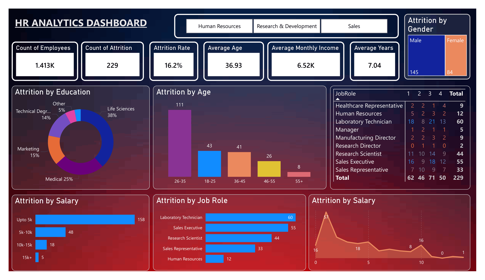

# HR Analytics Dashboard

## Overview
This Power BI dashboard analyzes employee attrition, workforce demographics, salary distribution, job satisfaction, and employee retention trends. It helps HR teams understand key factors affecting employee turnover and supports data-driven decision-making.

## Objectives
- Analyze employee attrition patterns.
- Identify factors contributing to employee turnover.
- Monitor workforce demographics and salary distribution.
- Evaluate job satisfaction across job roles.
- Support strategic HR decision-making.

## Dashboard Features

### Key Metrics
- Total Employees
- Total Attrition Count
- Attrition Rate (%)
- Average Age
- Average Monthly Income
- Average Years at Company

### Visualizations
- Attrition by Age Group
- Attrition by Gender
- Attrition by Education Field
- Attrition by Salary Slab
- Attrition by Job Role
- Attrition by Years at Company
- Job Satisfaction by Job Role
- Department-wise Analysis

## Key Insights
- Identify age groups with the highest attrition.
- Analyze employee turnover across job roles.
- Understand the impact of salary on attrition.
- Compare attrition rates by gender.
- Evaluate job satisfaction levels across roles.
- Analyze employee retention based on years at the company.
- Discover department-specific workforce trends.

## Tools Used
- Power BI Desktop
- Power Query
- DAX
- Data Modeling

## Dataset Information
The dataset contains employee-related information including:
- Age
- Gender
- Department
- Job Role
- Education Field
- Monthly Income
- Years at Company
- Job Satisfaction
- Attrition Status

## Skills Demonstrated
- Data Cleaning
- Data Transformation
- Data Modeling
- DAX Calculations
- Dashboard Design
- Data Visualization
- HR Analytics

## Dashboard Preview



## Business Value
This dashboard helps organizations:
- Reduce employee turnover
- Improve employee retention strategies
- Enhance workforce planning
- Identify attrition risk factors
- Make data-driven HR decisions

## Repository Structure
```
HR-Analytics-Dashboard/
│
├── HRDataAnalysis.pbix
├── README.md
├── images/
│   └── dashboard.png
└── dataset/
    └── HR_Analytics.csv
```
## Author
Kartik

If you found this project useful, consider giving it a ⭐ on GitHub.
